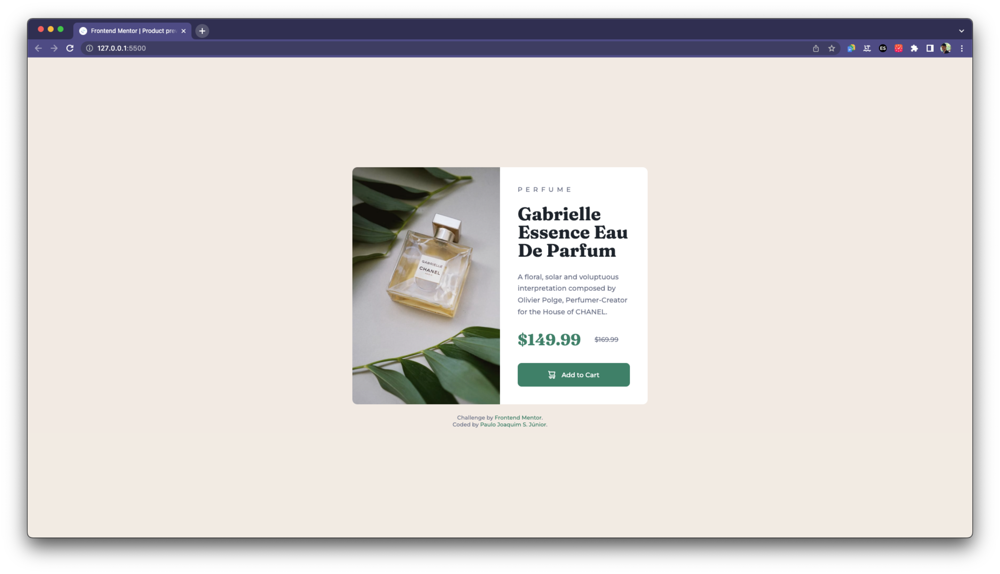
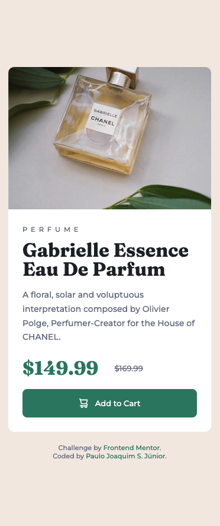

# Frontend Mentor - Product preview card component solution

This is a solution to the [Product preview card component challenge on Frontend Mentor](https://www.frontendmentor.io/challenges/product-preview-card-component-GO7UmttRfa). Frontend Mentor challenges help you improve your coding skills by building realistic projects.

## Table of contents

- [Overview](#overview)
  - [The challenge](#the-challenge)
  - [Screenshot](#screenshot)
  - [Links](#links)
- [My process](#my-process)
  - [Built with](#built-with)
  - [What I learned](#what-i-learned)
  - [Continued development](#continued-development)
- [Author](#author)

**Note: Delete this note and update the table of contents based on what sections you keep.**

## Overview

### The challenge

Users should be able to:

- View the optimal layout depending on their device's screen size
- See hover and focus states for interactive elements

### Screenshot




### Links

- Solution URL: [Add solution URL here](https://your-solution-url.com)
- Live Site URL: [Add live site URL here](https://your-live-site-url.com)

## My process

### Built with

- Semantic HTML5 markup
- CSS custom properties
- Flexbox
- CSS Grid
- Mobile-first workflow
- [Styled Components](https://styled-components.com/) - For styles

### What I learned

Along my journey, working through this project, I learned some properties using CSS utilities like classes and the best way to reuse color without write the same thing many times. It provides a CSS stylesheet more clean and organized
:

```html
<div class="product-content">
  <span class="color-s2">Perfume</span>
  <h1 class="color-s1">Gabrielle Essence Eau De Parfum</h1>
</div>
```

```css
:root {
  --color-cream: hsl(30, 38%, 92%);
  --color-darkcyan: hsl(158, 36%, 37%);

  --color-very-dark-blue: hsl(212, 21%, 14%);
  --color-dark-grayish-blue: hsl(228, 12%, 48%);
  --color-white: hsl(0, 0%, 100%);
}

.color-p2 {
  color: var(--color-darkcyan);
}
```

I also learned about <picture> tag in HTML and <source> which allow replacing images in accordance with the screen size @media:

```html
<picture class="image-bg">
  <source media="(max-width: 400px)" srcset="images/image-product-mobile.jpg" />
  
</picture>
```

```css
@media (max-width: 400px) {
}
```

### Continued development

I want to continue focusing on in CSS proprieties like grid and flex-box. Image position is also an interesting topic that provides better useful tools and positions along the layout development.

I want to keep and improving my knowledge to a higher level and start to programming using JavaScript.

## Author

- Website - [Paulo Joaquim S. Júnior](https://www.your-site.com)
- Frontend Mentor - [@paulojsjunior](https://www.frontendmentor.io/profile/paulojsjunior)
- GitHub - [@paulojsjunior](https://github.com/paulojsjunior)
